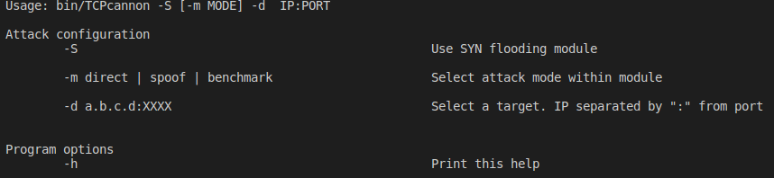

# TCPcannon

TCPcannon is a Linux tool for launching network attacks. It is built on top of [RawTCP](https://github.com/marsan27/RawTCP_Lib.git), my library to manage network packets and raw sockets. 

The purpose of this development is to reproduce real network attacks using only the C language and with minimal dependencies.

Currently it only incorporates a SYN flooding module with and without spoofing, but more attacking modules and modes will come in later updates.

The name is a reference to the [LOIC](https://en.wikipedia.org/wiki/Low_Orbit_Ion_Cannon).

## Installation
You can download the binary file for TCPcannon [here](https://github.com/marsan27/TCPcannon/releases/tag/v0.1.0).

## Usage

Run ./TCPcannon -h to get tool usage:



## Examples
Note: As stated in the library [RawTCP](https://github.com/marsan27/RawTCP_Lib.git), raw sockets require root proviliges to be used, so you will need them before running any of these examples. 

### SYN flood attack against 192.168.1.1 at port 8080
```sh
./TCPcannon -S -m direct -d 192.168.1.1:8000
```

### SYN flooding against 192.168.1.1 at port 8080 randomly with spoofing
Source IP changes randomly between each sent packet.
```sh
./TCPcannon -S -m spoof -d 192.168.1.1:8000
```

### Benchmark for packets/minute sent with SYN flooding spoofing mode
You will get the number of packets sent and packets/minute.
```sh
./TCPcannon -S -m benchmark -d 192.168.1.1:8000
```

## Issues?
Whether it is a bug, question or suggestion, please [open a ticket](https://github.com/marsan27/TCPcannon/issues/new) and I will have a look at it as fast as I possibly can.
## LICENSE
This software is licensed under the MIT license. See [LICENSE](https://github.com/marsan27/TCPcannon/blob/master/LICENSE)
